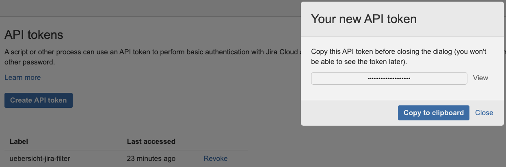
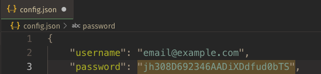

## A JIRA filter widget for Übersicht

http://tracesof.net/uebersicht/


### Installation

Add the extracted widget to your widgets folder.

Rename `config.example.json` to `config.json` and edit or add your jira domain and filter id. These two fields are required. The filter id can be found in the url to view a filter, e.g. [https://jira.atlassian.com/issues/?filter=17531](https://jira.atlassian.com/issues/?filter=17531) translates to:

```json
{
  "jira_domain": "jira.atlassian.com",
  "filter": "17531"
}
```

`username` and `password` can be configured to access your own filters or to access a cloud JIRA instance that requires authorization.

**IMPORTANT: if you are using a cloud JIRA instance, the authorization will NOT be your standard Atlassian username and password.** `username` should be the **email address** associated with your account. `password` should be an **API token** which you have explicitly generated for this widget.

To generate an API token, visit https://id.atlassian.com/manage/api-tokens and click **Create API token**:



Copy the result to your clipboard and paste it as the value of `password` in `config.json`:  



`startsAt` and `maxResults` are also configurable if you want to change the starting point of the filter or how many results are returned and displayed, respectively. There are sensible defaults and their presence is not required in `config.json`.

### Übersicht, Accessibility, and clicking links

Übersicht has a preference for an Interaction Shortcut that allows widget elements to be clicked while holding a configured modifier key. Out of the box, Übersicht doesn't ask for Accessibility access, so this preference doesn't appear to work at first. Add Übersicht to the list of apps in System Preferences > Security & Privacy > Privacy > Accessibility in order for this to work as expected.

Once the Interaction Shortcut is allowed and configured, the JIRA key and summary fields are clickable and will open in your default browser.
