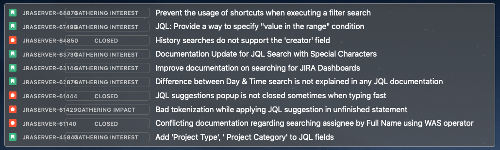

## A JIRA filter widget for Übersicht

http://tracesof.net/uebersicht/



### Installation

Add the extracted widget to your widgets folder.

Edit `config.json` to edit or add your jira domain and filter id. These two fields are required. The filter id can be found in the url to view a filter, e.g. [https://jira.atlassian.com/issues/?filter=17531](https://jira.atlassian.com/issues/?filter=17531) translates to:

```json
{
  "jira_domain": "jira.atlassian.com",
  "filter": "17531"
}
```

`username` and `password` can be configured to access your own filters or to access a cloud JIRA instance that requires authorization.

`startsAt` and `maxResults` are also configurable if you want to change the starting point of the filter or how many results are returned and displayed, respectively. There are sensible defaults and their presence is not required in `config.json`.
